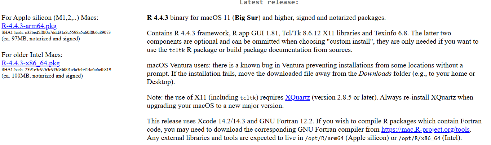

## Overview

This document provides instructions on how to install R and RStudio for both 
Windows and MacOS devices for the "R for Beginners" workshop.
Please have **both** R and RStudio installed **prior** to the workshop. If there
are any issues or questions regarding installation, please reach out to Alex Manos
([almanos@pinellas.gov](mailto:almanos@pinellas.gov)).

## Steps to Download R and RStudio

1) Go to [https://posit.co/download/rstudio-desktop/](https://posit.co/download/rstudio-desktop/) and scroll down to view the 
links to download R and RStudio (these are downloaded separately) (fig. 1).

2) Follow the instructions below to install R and RStudio on your computer based
on your operating system (Windows or MacOS).

{width=100%}

### Installing R on Windows

1) Click the “DOWNLOAD AND INSTALL R” button below “1: Install R” on the posit 
website.

2) Click "Download R for Windows" on the CRAN page (fig. 2).

3) Click “base”.

4) Click “Download R-X.X.X for Windows” (the ‘X’ will be a version number).

5) Allow the “R-X.X.X-win.exe” file to install and open the file.

6) Follow the install instructions and allow all recommended settings.

{width=100%}

### Installing R on MacOS

1) Click “Download R for macOS” (fig. 3).

2) Select the appropriate version to install on your Mac based on the type 
(Silicon chip or Intel chip) (fig. 4). You can check what chip type you have
by clicking the apple icon in the top left corner of your screen and selecting
“About this Mac”. The chip type will be listed in the popup window.

3) Allow the “.pkg” file to install and open the file.

4) Follow the install instructions and allow all recommended settings.

{width=100%}

{width=100%}

### Installing RStudio on Windows and MacOS

1) Click the "DOWNLOAD RSTUDIO DESKTOP FOR WINDOWS/MAC" button below “2: Install 
RStudio” on the posit website (fig. 1).

2) Once the program finishes downloading, open the “RStudio.exe” file.

3) Follow the install instructions and allow all recommended settings.
