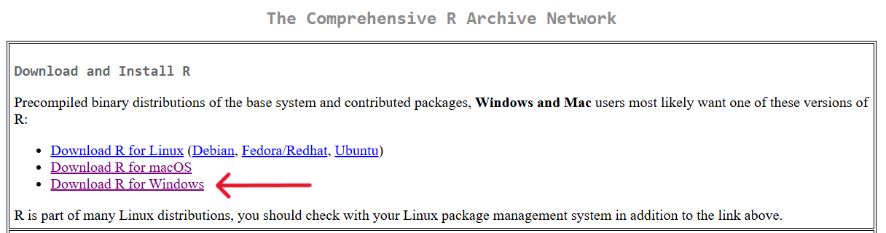
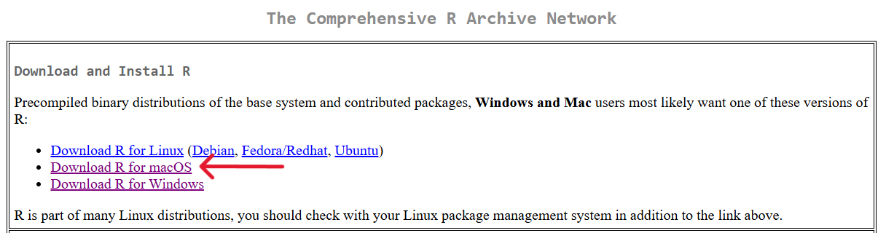
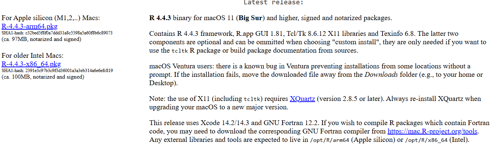
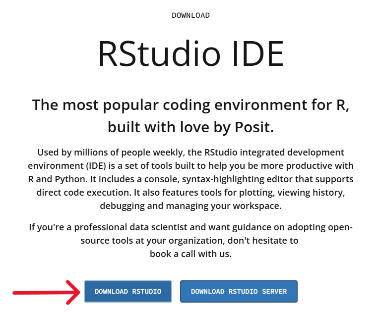

# Overview

This document provides instructions on how to install R and RStudio for both Windows and MacOS devices for the R for Beginners and Vibe Coding in R workshops. Please follow the instructions below to either install both R and RStudio prior to the workshop or upgrade the versions on laptop computer.  

# Installing R

1) Go to [https://cran.r-project.org/](https://cran.r-project.org/).

2) Follow the instructions below to install R based on your computer's operating
system.

NOTE: If this is a computer owned by your employer and you are blocked from installing, you may have to contact your IT administrative staff to receive permission to allow you to install the software. 

## Installing R on Windows

1) Click "Download R for Windows" on the CRAN page (fig. 1).

3) Click “base”.

4) Click “Download R-X.X.X for Windows” (the ‘X’ represents the version number).

5) Allow the “R-X.X.X-win.exe” file to download and open the file.

6) Follow the install instructions and allow all recommended settings.

{width=100%}

## Installing R on MacOS

1) Click “Download R for macOS” (fig. 2).

2) Select the appropriate version to install on your Mac based on the chip type 
(Silicon chip or Intel chip) (fig. 3). You can check what chip type you have
by clicking the apple icon in the top left corner of your screen and selecting
“About this Mac”. The chip type will be listed in the popup window.

3) Allow the “.pkg” file to download and open the file.

4) Follow the install instructions and allow all recommended settings.

{width=100%}

{width=100%}

# Installing RStudio

1) Go to [https://posit.co/downloads](https://posit.co/downloads). 

2) Click the "DOWNLOAD RSTUDIO" link. (fig. 4)

3) Download the appropriate RStudio based on your computer's operating system 
(e.g., Windows, MacOS, etc.).

4) Open the download and follow the installation instructions.

5) After the installation is complete, go ahead and run R Studio (not R) by searching
for the app using your computers search interface
{width=67%}

# Upgrading R and RStudio

If you already have a version of R and R Studio on your computer and they don’t match the current versions, it is a good idea to upgrade them in case an incompatibility arises during the workshop exercises. The current versions of these programs are:

**R**: R-4.6.1
**RStudio**: RStudio 2026.08.1+195

Just as with the original installation, the order of updates is to first update 
R then update RStudio which will automatically find the most recent R install. 

## Upgrading R

### Check R version

1) Open RStudio
2) Type "version" in the console and hit enter
3) Read the "version.string"

Follow the original installation instructions to upgrade R, or install R through
the Rgui by searching for the Rgui.exe for finding its path location (ex. C:\Program Files\R\R-4.0.2\bin\x64). Once the R GUI window opens, run the following lines

`> install.packages("installr")`
`> library(installr)`
`> updateR()`

The last line will start the updating process of your R installation by: “finding the latest R version, downloading it, running the installer, deleting the installation file, copying and updating old packages to the new R installation.” Prior to doing this, you may want to save a list of your old packages using the following code (in case there is a problem copying or updating packages):

`> my.packages <- installed.packages()`
`> save(my.packages, file = "listOfInstalledPackages.RData") # note this will save in your current working directory`

## Upgrading RStudio

To check RStudio Version:

1) Open RStudio
2) Click the "Help" tab
3) Click "Check for Updates" to see if there is a newer version available
4) If a new version is available download and install it

