```{r}
# Function for a countdown on the exercise slides:
cntdn <- function(){
  library(countdown)
  countdown(
    minutes = 10,
    seconds = 0,
    play_sound = TRUE,
    top = "80%",
    right = "50%",
    font_size = "60px",
    color_background = '#F04124',
    color_border = '#F04124',
    color_text = 'black'
  )
}
```


## Outline

If you want to follow along with the slides (optional) `https://rpubs.com/aman11/flms_R_workshop_2026`

-   Introductions
-   R vs. RStudio
-   Use cases
-   Installing R & RStudio
-   R coding basics
-   Coding practice
-   Tidy data principles


## Introductions

- Name
- Organization
- Experience with R (if any)


## Goals for This Workshop

- Basic understanding of R and RStudio
- Comfortable with the RStudio interface and running code
- Develop a VERY basic understanding of R coding principles
- Knowledge of tidy data and how to properly format data


##  {background-color="#006791"}

::: {style="font-size: 3em; text-align: center; margin-top: 30vh; font-weight:bold;"}
Background
:::


## What is R?


:::{.fragment .fade-in}
Wikipedia says:

"*R is a programming language for statistical computing and data visualization.*"

{.absolute top="200" left="720" width="260" height="235"}
:::

::: {.incremental}
- Data wrangling/tidying
- Statistical analysis
- Data visualization
- Automation
:::


::: {.fragment .fade-in}
{.absolute top="410" left="380" width="205" height="250"}
:::


## Why use R?

- R is one of the most popular programming languages in ecological sciences.

- Open-source (free!) with a community of users and developers around the world
and throughout numerous sectors.

- Provides powerful tools for data analysis, visualization, and reporting.

:::{.fragment .fade-in fragment-index=1}
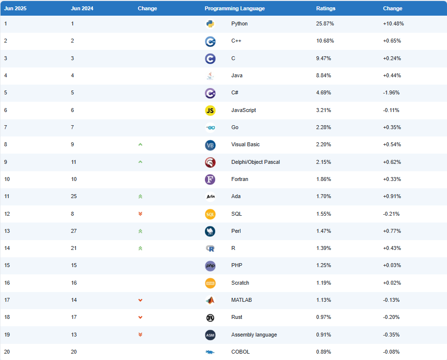{.absolute top="280" left="0" width="530" height="415"}
:::


:::{.fragment .fade-in fragment-index=2}
{.absolute top="290" left="545" width="200" height="70"}
{.absolute top="630" left="545" width="190" height="45"}
{.absolute top="400" left="925" width="170" height="60"}
{.absolute top="280" left="970" width="150" height="75"}
{.absolute top="400" left="545" width="140" height="75"}
{.absolute top="165" left="920" width="200" height="125"}
{.absolute top="620" left="795" width="160" height="75"}
{.absolute top="535" left="545" width="380" height="60"}
{.absolute top="290" left="760" width="190" height="70"}
{.absolute top="370" left="725" width="140" height="140"}
{.absolute top="485" left="965" width="140" height="115"}
:::


## What is RStudio?

-   RStudio is the IDE (Integrated Development Environment) for R.

-   Used for writing, running, and debugging R code.

-   Increases productivity and efficiency.

{.absolute top="340" left="130" width="700" height="250"}

## R vs. RStudio

-   R is the programming language

-   RStudio is the user interface for R (IDE)


:::{.fragment .fade-in}

R is the engine

RStudio is the informational display

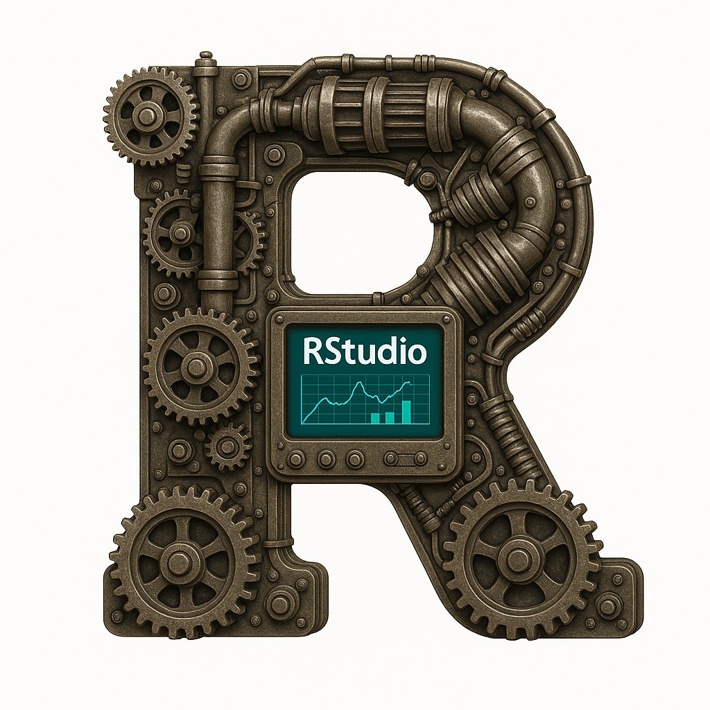{.absolute top="230" left="550" width="400" height="400"}
:::

## CRAN

```{r}
# Needed for available.packages()
options(repos = c(CRAN = "https://cran.rstudio.com/"))
```

-   CRAN (Comprehensive R Archive Network) is the official repository for the R language 
and R packages
-   CRAN is a network of servers that store R packages and documentation
-   Maintained by POSIT
-   When you install a package, it is (usually) downloaded from CRAN
- As of `r format(Sys.Date(), '%m/%d/%Y')`, there are `r format(nrow(available.packages()), big.mark = ",")` packages on CRAN!

{.absolute top="320" left="800" width="250" height="250"}


## R and R Package Security

- R and RStudio are safe and maintained by POSIT.
- POSIT runs unit tests on CRAN packages before they are released for security.
- Be careful about downloading packages from GitHub or other sources unless you
  review all of the code or is coming from a verified and trusted source.
- Sources like Stack Overflow and other coding websites are great for snippets


##  {background-color="#006791"}

::: {style="font-size: 3em; text-align: center; margin-top: 30vh; font-weight:bold;"}
Use Cases
:::

## Use Case - Water Quality Monitoring

::::: columns
::: {.column width="40%"}
-   Sampling divided into:

    -   Streams
    -   Lakes/Coastal

\vspace{2em}

-   Nutrients, chlorophyll, Turbidity, bacteria, Dissolved Oxygen, etc.

\vspace{2em}

-   Sampling divided into "runs" with tidally influenced streams
:::

::: {.column width="60%"}
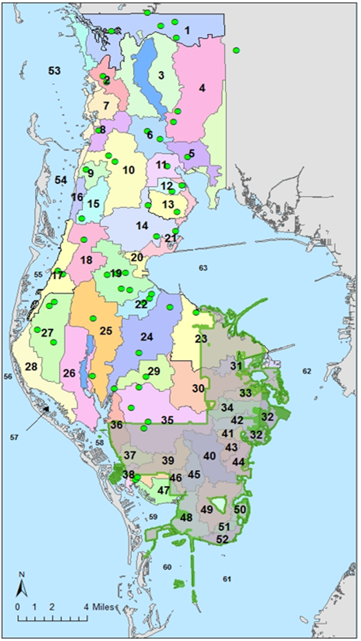{.absolute top="80" left="450" width="300" height="550"} 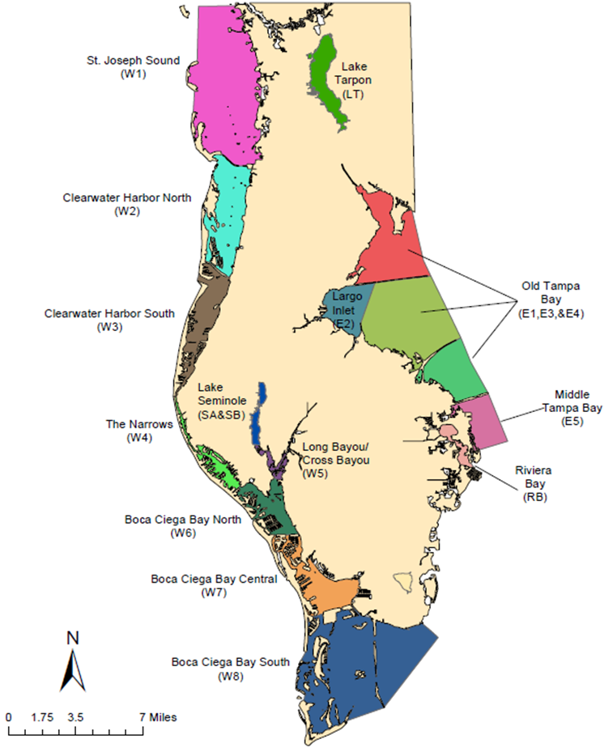{.absolute top="80" left="750" width="375" height="540"}
:::
:::::


## Stream Sampling Dates

::: columns
::: {.column width="60%"}
-   No previous automation

\vspace{2em}

-   Tide charts inspected for each site for optimal sampling dates

\vspace{2em}

-   `rtide` package used to automatically pull tidal height

\vspace{2em}

-   Algorithm developed to select optimal sampling dates based on time of outgoing tide

:::

::: {.column width="40%"}
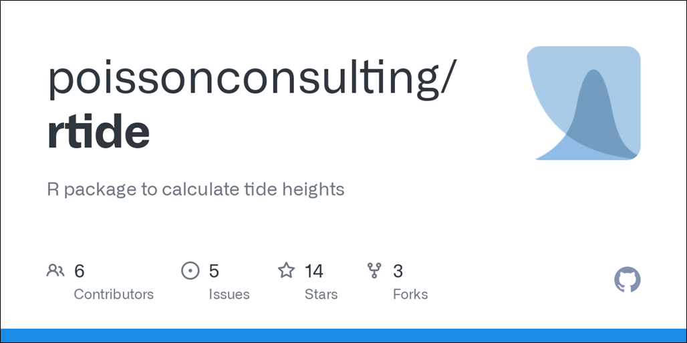
:::
:::

## Randomized Strata Sampling -- Old

-   SAS code 20+ years old and divided into multiple files

-   Only 1 license available within our group

-   Limited staff knowledge of SAS

{.absolute top="440" left="0" width="1000" height="150"}

{.absolute .fragment top="250" left="500" width="530" height="150"}

## Randomized Strata Sampling -- New

-   Old SAS code converted to R

-   Code available to all staff to view, edit, run

-   In-house expertise allows for customization

-   Combined with stream date code to generate yearly sampling schedule for streamlined process

{.absolute top="380" left="20" width="850" height="200"}

## Sample Bottle Kits

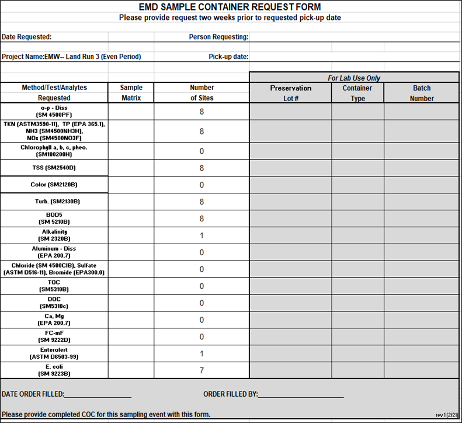{.absolute top="80" left="0" width="500" height="550"} 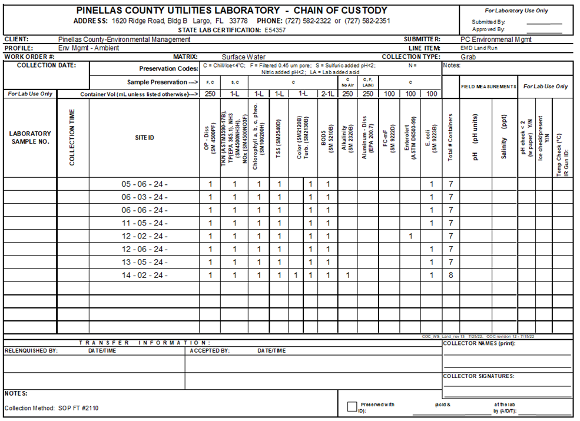{.absolute top="75" left="500" width="600" height="550"}

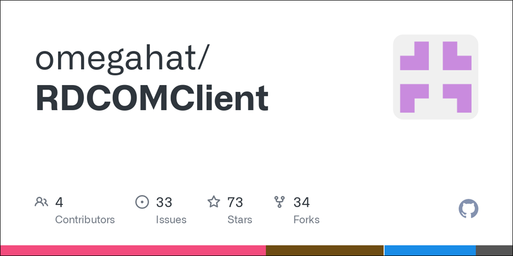{.absolute .fragment top="120" left="200" width="500" height="240"}

## Data QA/QC Semi-Automation

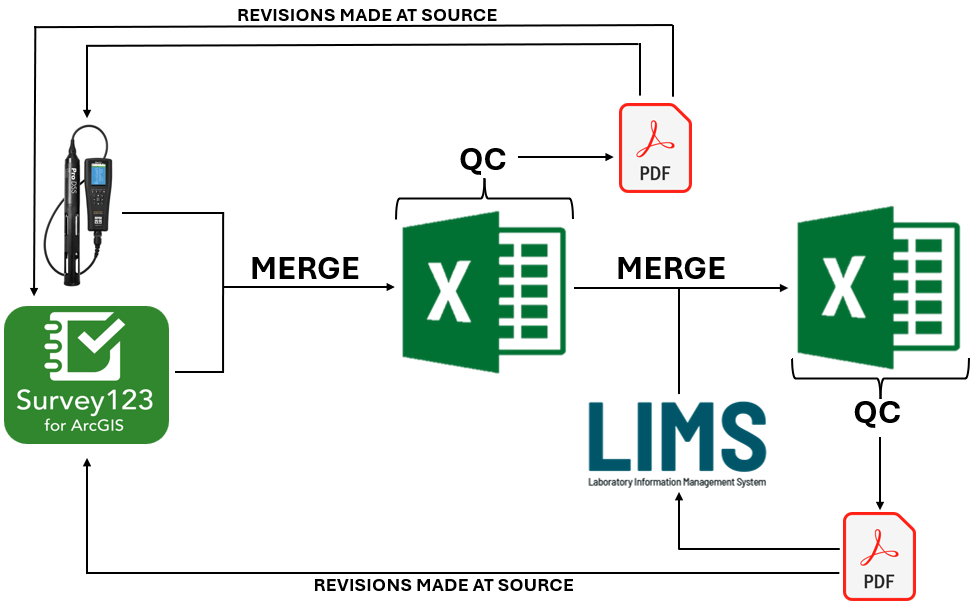{.absolute top="80" left="110" width="820" height="550"}


## Data QA/QC Semi-Automation

::: columns

::: {.column width="70%"}

::: {.fragment .semi-fade-out fragment-index=1}
-   Previous automation processes were limited to HACH systems, all other QA/QC checks were done manually (Time/date, missing data)
:::

::: {.fragment .fade-in fragment-index=1}
-   Current process performs all checks automatically and generates PDF report detailing each check conducted

    -   Reproducible QA/QC
    -   Provides digital paper trail
:::

::: {.fragment .fade-in fragment-index=3}
-   Processing time before automation: `5-8 weeks`
:::

::: {.fragment .fade-in fragment-index=4}
-   Processing time after automation: `2-4 weeks`
:::
:::

::: {.column width="30%"}
{.absolute top="80" left="750" width="400" height="250"}
{.fragment .fade-in fragment-index=2 .absolute top="360" left="750" width="200" height="215"}
:::
:::


## Dashboards

[https://pcdem.shinyapps.io/dashboard/](https://pcdem.shinyapps.io/dashboard/)

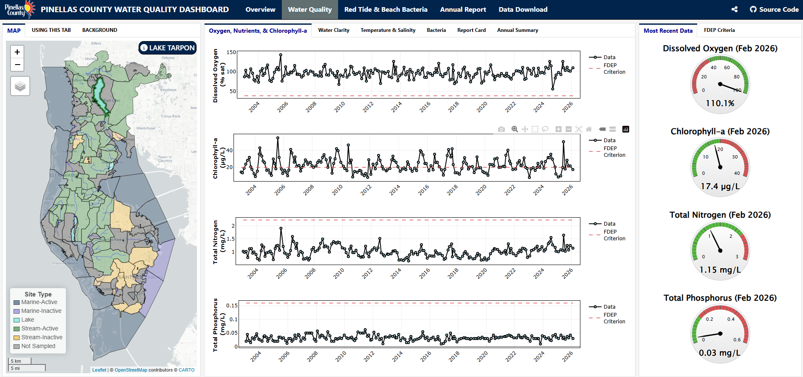{.absolute top="140" left="0" width="950" height="500"}
{.absolute top="140" left="950" width="140" height="155"}
{.absolute top="295" left="950" width="140" height="155"}

## Presentations

- This entire presentation was created using R and RStudio!

- The code used to create this presentation is available on GitHub

- The presentation is in `Quarto` format, which allows for easy conversion to HTML, 
PDF, and Word formats

```{r, echo=TRUE, eval=FALSE}
---
title: "R for Beginners"
subtitle: "FLMS 37th Annual Technical Symposium"
author: 
  - name: "Alex Manos, M.S."
    affiliation: "Pinellas County Division of Environmental Management" 
date: "2026-09-01"
format: 
  revealjs:
    controls: false
    date-format: "MMMM D, YYYY"
    theme: ["styles.scss"]
    logo: www/pinellas_logo.png
---
```

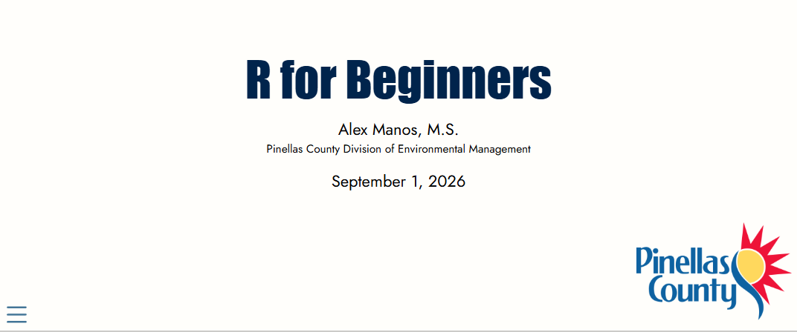{style="border: 2px solid black; width: 200px;" .absolute top="310" left="700" width="400" height="200"} 


## AI and Coding

-  AI is a powerful tool for generating code, but it is not perfect

-  You can use it to help learn code but you should try to figure it out yourself first

:::{.fragment .fade-in}
- You should have a basic understanding of the code and know how to problem-solve

{.absolute top="350" left="715" width="300" height="300"}
:::

{.absolute top="400" left="0" width="400" height="110"}
{.absolute top="400" left="405" width="300" height="200"}


##  {background-color="#006791"}

::: {style="font-size: 3em; text-align: center; margin-top: 30vh; font-weight:bold;"}
Installing R & RStudio
:::

## Installing R

- R can be downloaded from the R [CRAN](https://cran.r-project.org/) webpage

- Click "Download R for (your OS)" 
  + **Windows**: Click "base" and then "Download R x.x.x for Windows"
  + **macOS**: Select the correct `.pkg` file based on your chip specs

- Follow the installation instructions

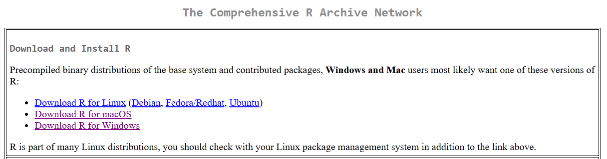{.absolute top="370" left="0" width="720" height="200"}


## Installing RStudio

- RStudio can be downloaded from the [posit](https://posit.co/downloads) webpage

- Click "Download RStudio"

- Click the RStudio `.exe` file to download and follow the instructions

- You can open RStudio by clicking the icon or searching your applications

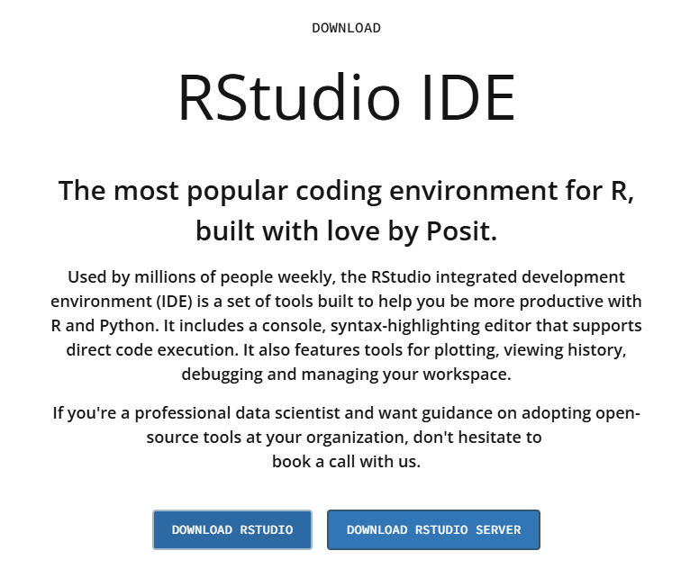{.absolute top="320" left="0" width="450" height="320"}
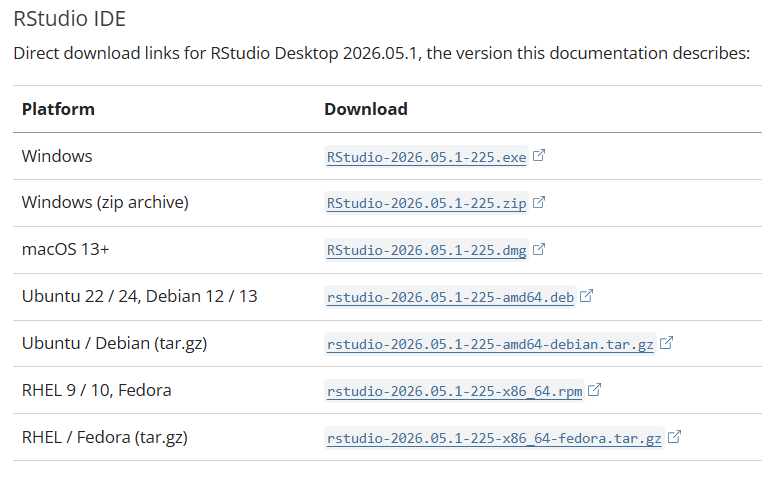{.absolute top="350" left="520" width="500" height="290"}


## Changing R Version

RStudio allows you to change the version of R you are using

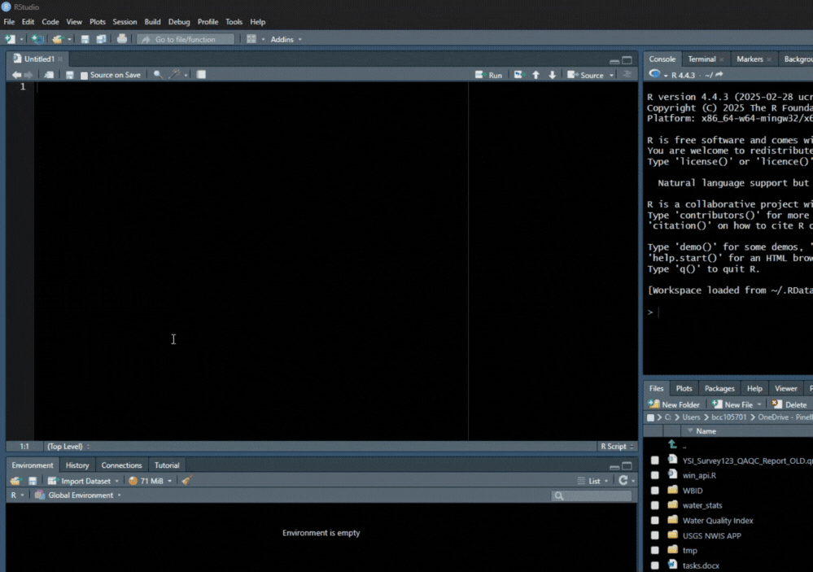{.absolute top="160" left="110" width="800" height="530"}


##  {background-color="#006791"}

::: {style="font-size: 3em; text-align: center; margin-top: 30vh; font-weight:bold;"}
R Coding Basics
:::

## Common Terms

[**R-specific**]{style="color:#006791"}

-   **Object**: A variable, data frame, or other data structure
-   **Script**: A file containing R code
-   **Function**: A block of code that performs a specific task (`function()`)
-   **Argument**: A value passed to a function
-   **Package**: A collection of functions and data sets

[**RStudio-specific**]{style="color:#006791"}

-   **Panel**: A section of the RStudio interface
-   **Project**: A collection of files and settings for a specific task
-   **Environment**: A list of objects currently in memory


## Navigating RStudio

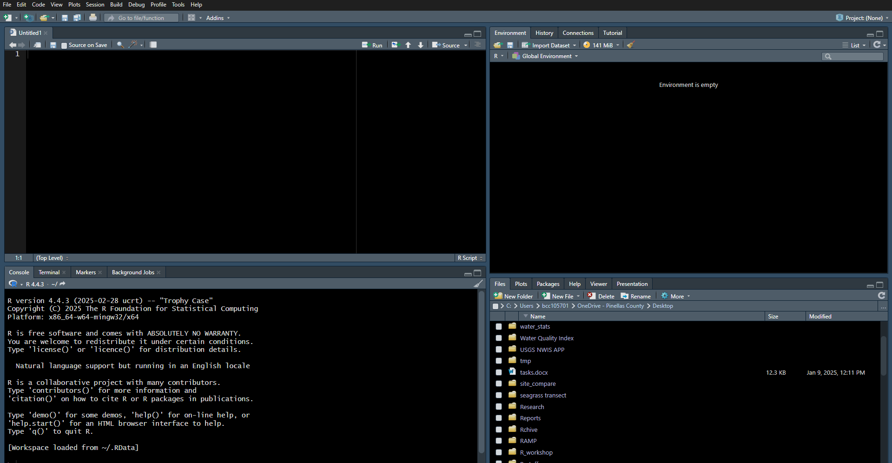{.absolute top="70" left="0" width="1000" height="600"}

::: {.fragment .fade-in fragment-index=1 style="color:red; position:absolute; top:220px; left:90px;"}
Code can be <br> written here
:::

::: {.fragment .fade-in fragment-index=2 style="color:red; position:absolute; top:250px; right:200px;"}
Imported data and <br> variables are here
:::

::: {.fragment .fade-in fragment-index=3 style="color:red; position:absolute; top:510px; right:160px;"}
Files, plots, and <br> packages are here
:::

::: {.fragment .fade-in fragment-index=4 style="color:red; position:absolute; top:510px; right:540px;"}
Output from code <br> displayed here
:::


## Running Code

You can run a line of code by placing the cursor before the line or anywhere
in the line and pressing 'Ctrl + Enter' (Windows) or 'Cmd + Enter' (Mac).

```{r echo=TRUE, eval=TRUE}
500
```

Notice the '500' printed to the console.

You can also highlight a block of code and run it all at once. 
```{r echo=TRUE}
100
200
300
```


## Basic Math

R is equipped with many mathematical operations

```{r echo=TRUE}
5 + 5 # Addition
```

```{r echo=TRUE}
5 - 5 # Subtraction
```

```{r echo=TRUE}
5 * 5 # Multiplication
```

```{r echo=TRUE}
5 / 5 # Division
```

```{r echo=TRUE}
5 ^ 5 # Exponentiation (or **)
```

```{r echo=TRUE}
log(100) # Natural log
```

```{r, echo=TRUE}
6*4/(2^2*3)-2 # PEMDAS
```

## Logical Statements & Booleans

|Test   |    Meaning|
|--------|-----------|
| `x < y` | Less than |
| `x > y` | Greater than|
| `==` | Equal to |
| `x <= y` | Less than or equal to |
| `x >= y` | Greater than or equal to |
| `x != y` | Not equal to |
| `x | y` | Or |
| `x & y` | And |
| `x %in% y` | Is in |
| `is.na(x)` | Is missing |
| `!is.na(x)` | Is not missing |


## Logical Statements & Booleans (cont.)

```{r echo=TRUE}
1 > 2
```

```{r echo=TRUE}
1 < 2
```

```{r echo=TRUE}
1 == 2
```

```{r echo=TRUE}
1 != 2
```

```{r echo=TRUE}
1 < 2 | 3 > 4 ## OR: only one test needs to be true to return TRUE
```

```{r echo=TRUE}
1 < 2 & 3 > 4 ## AND: both tests need to be true to return TRUE
```

## Logicals and Boolean Precedence

- `R` like most other programming languages will evaluate the logical operators 
(`==`, `>`, etc) before the booleans (`&`, `|`, etc).

:::{.fragment .fade-in fragment-index=1}
```{r, echo=TRUE}
1 > 0.5 & 2
```
:::

:::{.fragment .fade-in fragment-index=2}
- In this case, `R` is evaluating two separate logical statements:
:::

:::{.fragment .fade-in fragment-index=3 style="font-size: 80%"}
&nbsp;&nbsp;&nbsp;&nbsp;- `1 > 0.5`, which is `TRUE`
:::

:::{.fragment .fade-in fragment-index=4 style="font-size: 80%"}
&nbsp;&nbsp;&nbsp;&nbsp;- `2`, which is `TRUE` because `R` evaluates it as `as.logical(2)` which is always `TRUE`
:::

:::{.fragment .fade-in fragment-index=5}
```{r, echo=TRUE}
1 > 0.5 & 1 > 2 # Evaluate two separate logical statements together
```
:::

:::{.fragment .fade-in fragment-index=6}
```{r, echo=TRUE}
1 > 0.5 | 1 > 2 # Evaluate two separate logical statements individually
```
:::

## Cool, Now What?

:::{.fragment .fade-in fragment-index=1}
- Many different tasks can be done by combining the basic math and logical
  statements.
:::

:::{.fragment .fade-in fragment-index=2}
- But we may need to set up a group of tests to do something.
:::

:::{.fragment .fade-in fragment-index=3}
- We need to ***Assign them*** to reuse them later in functions, loops, etc.
:::
## Assignment

- The most popular assignment operator in `R` is `<-` which is just `<` followed
by `-`
  + Read aloud as "gets"

```{r, echo=TRUE}
x <- "Hello, World!" # note that text need to be wrapped in quotes
x # here you would "call" the variable to return the assigned value
```

- `x` is the variable and `"Hello, World!"` is the value assigned to it

<br> 

:::{.fragment .fade-in fragment-index=1}
- Using `=` as an assignment operator also works but is not recommended since it
  is also used to define arguments within functions
  
- Mostly a matter of preference but will be easier for other programmers to read

- Just keep it consistent
:::

## Naming Variables

- Variable names can be anything you want but there are some rules to help make 
  your code more readable:
  
:::{.fragment .fade-in fragment-index=1}
1) Use descriptive names for objects and functions
:::

:::{.fragment .fade-in fragment-index=2}
2) Use camelCase or snake_case for naming objects and functions
:::

:::{.fragment .fade-in fragment-index=4}
3) Keep names short but descriptive
:::

:::{.fragment .fade-in fragment-index=5}
4) Avoid using special characters (e.g. $, %, &, etc.) in variable names
:::

:::{.fragment .fade-in fragment-index=6}
5) Don't start variable names with a number
:::

:::{.fragment .fade-in fragment-index=7}
- Some of these rules must be followed to avoid errors, others are just good practice
:::

## Naming Variables (cont.)

[**Good Names**]{style="color:darkgreen"}

```{r, echo=TRUE}
avgTemp <- 75 # camelCase
avg_temp <- 75 # snake_case
```

[**Bad Names**]{style="color:darkred"}

```{r, echo=TRUE}
avarageTemperature_1_2  <- 75 # misspelled "average" and too long
a.T <- 75 # not descriptive enough
```

:::{.fragment .fade-in}

Note the errors in the naming below

```{r, echo=TRUE, error=TRUE}
1stAvgTemp <- 75 # Variable name cannot start with a number
```

```{r, echo=TRUE, error=TRUE}
avgTemp% <- 75 # Variable name cannot contain special characters
```
:::

## Naming Variables (cont.)

There are some names we can never use because they are reserved for R

```{r, echo=TRUE, eval=FALSE}
# Control structures
if
else
while
for

# Function definition
function

# Constants
TRUE
FALSE
NULL
Inf
NaN
NA
```

There are more that can't be used but you'll see an error if you try to use them

## Functions

- Functions are blocks of code that perform a specific task
- Functions can take arguments (inputs) and return values (outputs)
- Functions can be built-in or user-defined

```{r, echo=TRUE}
mean(x = c(1, 2, 3))
```

```{r, echo=TRUE}
min(x = c(1, 2, 3))
```

```{r, echo=TRUE}
sd(c(1, 2, 3)) # note the argument is not named
```

- The argument does not have to be named for all functions, but may be necessary
the more arguments a function has.

:::{.fragment .fade-in}
- Use the `?` operator followed by the function name to view documentation about
that function

```{r, echo=TRUE, eval=FALSE}
?mean # don't need to include parentheses
```
:::

## Working with objects

```{r, echo=TRUE}
e <- c(1, 2, 3, 4, 5, 6, 7, 8, 9, 10) # use c() to combine values into a vector

length(e) # How many things are in there?
```

```{r, echo=TRUE}
sum(e)/length(e) # Hand calculate mean
```

```{r, echo=TRUE}
mean(e) # R function to calculate mean
```

```{r, echo=TRUE}
e <- data.frame(x = 1:5,
                y = 11:15)
e
```

```{r, echo=TRUE, error=TRUE}
mean(y)
```

## Global Environment

```{r, echo=TRUE, eval=FALSE}
Error: object 'y' not found
```

:::{.fragment .fade-in}
- The global environment is where all your objects live and can give us a hint 
about what went wrong

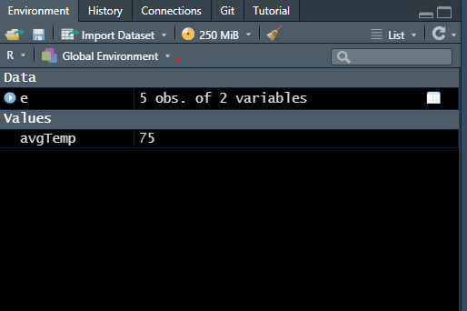{.absolute top="250" left="160" width="600" height="450"}
:::

## Fixing Our Issue

- To get the mean of `y` we need to "index" `e` using the `$` operator

```{r, echo=TRUE}
mean(e$y)
```

- R will look for named objects in the environment
- If the interpreter can't find `y` or any other object, it will give up because
it does not think it exists
- You need to tell the interpreter what to look for inside of the object

## What are Objects?

- Objects are what we work with in `R`

```{r}
apropos("^is")
```

## Vectors

- Vectors are the most basic data structure in R and are a sequence of values

- Come in two types:
  + **Atomic**: Must be the same type
  + **Lists**: can be different types
  
```{r, echo=TRUE}
myVec <- 1:10
is.vector(myVec) # Check if my_vec is a vector
```

```{r, echo=TRUE}
myList <- list(a = 1:4, b = "Hello, World!", c = data.frame(x = 1:5, y = 11:15))
is.vector(myList) # Check if my_list is a vector
```

:::{.fragment .fade-in}
{.absolute top="470" left="215" width="460" height="220"}
:::

## Atomic Vectors

- Can come in a variety of types:
  + Numeric: can contain whole numbers and decimals
  + Logicals: can only take two values TRUE or FALSE
  + Characters: holds character string
  + Factors: used to store categorical data
  

## Accessing Vector Elements

- You can access the elements of a vector by "indexing" the position of that element
- We use the `[]` operator to index vectors

- The first element of a vector is at position 1, not 0
- You can use `:` to index a range of elements
- You can use `c()` to index multiple, non-consecutive elements
- You can also use negative indexing to exclude elements
- Lists require `[[]]` to access the vector, followed by `[]` to access the elements   of that vector


## Indexing Vectors

```{r, echo=TRUE}
vec <- rnorm(n = 10, mean = 30, sd = 10) # vector of random values
vec
```

:::{.fragment .fade-in fragment-index=1}
```{r, echo=TRUE}
vec[1] # first element
```
:::

:::{.fragment .fade-in fragment-index=2}
```{r, echo=TRUE}
vec[1:5] # first 5 elements
```
:::

:::{.fragment .fade-in fragment-index=3}
```{r, echo=TRUE}
vec[c(1, 3, 5)] # first, third, and fifth elements
```
:::

:::{.fragment .fade-in fragment-index=4}
```{r, echo=TRUE}
vec[-c(1, 3, 5)] # all but the first, third, and fifth elements
```
:::

:::{.fragment .fade-in fragment-index=5}
```{r, echo=TRUE}
vec[vec > 30] # all elements greater than 30
```
:::

## Indexing Lists

```{r, echo=TRUE}
myList <- list(num = 1:5, name = c('Joe','Bob','Mary'))
myList
```

```{r, echo=TRUE}
myList[[1]] # vector element in the list
```

```{r, echo=TRUE}
myList[[2]][1] # first element of the second vector in the list
```

:::{.fragment .fade-in fragment-index=1}
You can also use the `$` operator to access list elements by name

```{r, echo=TRUE}
myList$num # first vector in the list
```

```{r, echo=TRUE}
myList$name[1] # first element of the second vector in the list
```
:::

## Installing Packages

- Packages can be installed through 2 methods: console/script or RStudio interface

- *Console/Script*: `install.packages("package_name")` 
  + If you want to install multiple packages at once you can do
  `install.packages(c("package1", "package2"))`

- *RStudio*: Click the "Packages" tab in the bottom-right window pane.Then click
"Install" and search for the package you want to install. 

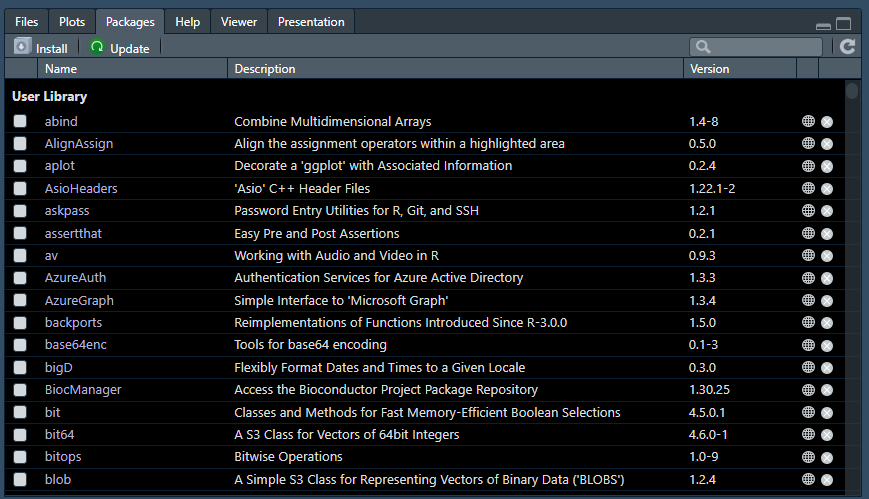{.absolute top="410" left="0" width="500" height="300"}

## Loading Packages

Once the packages are installed we need to load them into our `R` session with 
the `library()` function

```{r, echo=TRUE, eval=FALSE}
# Use the '#' symbol to talk to ourselves by 'commenting out' lines.
# R will not run any line with a '#' in front of it.
library(package1)
library(package2)
```

<br> 

:::{.fragment .fade-in}
- Notice too that you don't need quotes around the package names anymore.
- `R` now recognizes these packages as defined objects with given names
:::


## Setting Your Working Directory

- Your working directory is where all your files live
- R does not know where your files are unless you tell it
- If you want to use any data that does not come with a package, you need to tell
R where it lives

::: {.fragment .fade-in fragment-index=1}
```{r, echo=TRUE}
# The working directory where R will look for files 
getwd()
```
:::
                                                                                
<br>

::: {.fragment .fade-in fragment-index=2}
```{r, echo=TRUE, eval=FALSE}
# Set the working directory to the folder where your files are
setwd("C:/Users/YourName/Documents/YourProject")
```
:::


## Your Turn {background-color="#ffeeee"}

1) Install and load the packages `tidyverse`, `psych`, and `palmerpenguins`
using the `install.packages()` and `library()` functions.
2) Make a vector of 50 random values with a mean and standard deviation of your 
choice using the `rnorm()` function and assign it to a variable named `vec` 
(hint: use `?rnorm` to read the argument descriptions).
3) Get summary statistics for the vector using the `describe()` function.
4) Use `[]` indexing to return the first 10 values of the vector.
5) Plot your data using the `plot()` function.


```{r}
cntdn()
```


##  {background-color="#006791"}

::: {style="font-size: 3em; text-align: center; margin-top: 30vh; font-weight:bold;"}
Starting a New Project
:::


## Create New Project
- Follow these steps to create a new project:
  1) Go to `File` in the upper left corner of RStudio
  2) Select `New Project`
  3) Select `New Directory`
  4) Select `New Project`
  5) Set the `Directory name:` to `penguins`
  6) Click `Browse...` and set the directory to your desktop or other location
  7) Click `Create Project`

  
## Create New File

- Once the new project session has opened make a new file to write code in:
  1) Go to `File` in the upper left corner of RStudio
  2) Select `New File`
  3) Select `R Script`
  4) Save the file as `penguins.R`
  
:::{.fragment .fade-in}
- You can also use keyboard shortcuts to make a new file (Ctrl + Shift + N) and
  save it (Ctrl + S)
:::


## Data we Will Use


## Our Data

```{r, echo=TRUE}
library(palmerpenguins)
```

:::{.fragment .fade-in fragment-index=1}
```{r, echo=TRUE}
head(penguins) # view the first 10 rows
```
:::
  
:::{.fragment .fade-in fragment-index=2}
```{r, echo=TRUE}
str(penguins) # view the structure of the data
```
:::

:::{.fragment .fade-in fragment-index=3}
```{r, echo=TRUE, eval=FALSE}
View(penguins) # view the data in a new window
```
:::

## Indexing Data Frames

:::{style="font-size: 80%;"}
- We can use column position to index objects.
- There are two slots we can use to extract data: *rows* and *columns*
- `object_name[row, column]`
- We can also subset out data by column position using `:` or `c(column_1, column_2)`
:::

:::{.fragment .fade-in fragment-index=1}
```{r, echo=TRUE}
penguins[1,1]
```
:::

:::{.fragment .fade-in fragment-index=2}
```{r, echo=TRUE}
penguins[1, 1:2]
```
:::

:::{.fragment .fade-in fragment-index=3}
```{r, echo=TRUE}
penguins[1, c(1, 4)]
```
:::

## Negative Indexing

- We can also exclude various elements using `-` and/or logical tests

```{r, echo=TRUE}
penguins[,-1]
```

:::{.fragment .fade-in}
```{r, echo=TRUE}
names(penguins)
```
:::

## `$` Indexing

A more common way to index data is to use the `$` operator to reference data by 
name rather than position.

```{r, echo=TRUE}
penguins$species
```

```{r, echo=TRUE}
penguins$species[1:10]
```

## Indexing by Tests

```{r, echo=TRUE}
penguins[penguins["sex"] == 'female', c('species', 'island')]
```

:::{.fragment .fade-in}
However, this is not the most efficient or (more importantly) readable way to do this...
:::

## A (very) Brief Introduction to Tidyverse

- The `tidyverse` is a collection of packages that work together to make data
  analysis easier and more efficient.
- The `tidyverse` is built around the idea of "tidy data" which is a way of
  organizing data so that it is easy to work with.
- Part of the `tidyverse` is the idea of "piping" which allows you to chain together
  multiple functions to create a single workflow.
  + The pipe operator can be written as `%>%` or `|>`

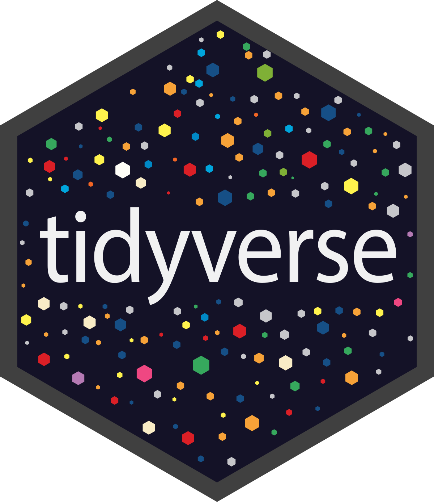{.absolute top="360" left="747" width="250" height="270"}
  

## The Tidyverse Ecosystem

The [tidyverse](https://www.tidyverse.org/) is a package that installs other packages used for data wrangling,
analysis, and visualisation and include:

- [ggplot2](https://ggplot2.tidyverse.org/): data visualisation
- [dplyr](https://dplyr.tidyverse.org/): data manipulation
- [tidyr](https://tidyr.tidyverse.org/): data tidying
- [readr](https://readr.tidyverse.org/): data import
- [purrr](https://purrr.tidyverse.org/): functional programming
- [tibble](https://tibble.tidyverse.org/): data frames
- [stringr](https://stringr.tidyverse.org/): string manipulation
- [forcats](https://forcats.tidyverse.org/): categorical variables
- [lubridate](https://lubridate.tidyverse.org/): date and time manipulation

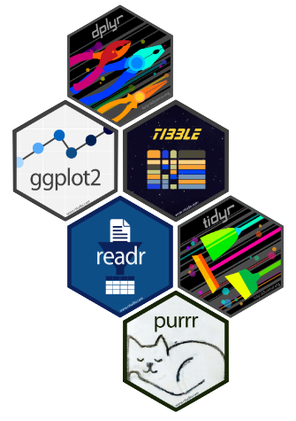{.absolute top="130" left="650" width="380" height="520"}

## Piping Functions

Any guesses?

```{r, echo=TRUE}
round(log(mean(penguins$body_mass_g[penguins$species == 'Adelie' & penguins$island == 'Torgersen'], 
           na.rm = TRUE)), 0)
```

:::{.fragment .fade-in fragment-index=1}
```{r, echo=TRUE}
library(tidyverse)
```

```{r, echo=TRUE, `code-line-numbers`="1-6|1|2|3|4|5|6"}
penguins |> # start with the dataset
  filter(species == 'Adelie', island == 'Torgersen') |> # filter the data 
  summarise(mean_mass = mean(body_mass_g, na.rm = TRUE)) |> # calculate the mean
  pull(mean_mass) |> # pull out the mean mass
  log() |> # notice no arguments inside parentheses
  round(0) # round the result
```
:::

:::{.fragment .fade-in fragment-index=2}
Although the piping adds lines, it makes the code much more readable
:::

## Example {auto-animate="true"}

Calculate the average bill length?

## Example {auto-animate="true"}

Calculate the average bill length?

```{r, echo=TRUE}
penguins$bill_length_mm
```

## Example {auto-animate="true"}

Calculate the average bill length?


```{r, echo=TRUE}
mean(penguins$bill_length_mm)
```

## Example {auto-animate="true"}

Calculate the average bill length?

```{r, echo=TRUE}
mean(penguins$bill_length_mm, na.rm = TRUE)
```

## Example {auto-animate="true"}
Calculate the average bill length?

```{r, echo=TRUE}
mean(penguins$bill_length_mm, na.rm = TRUE)
```

Tidyverse version:

```{r, echo=TRUE}
penguins |>
  summarise(mean_bill_length = mean(bill_length_mm, na.rm = TRUE))
```

## Example {auto-animate="true"}

Calculate the average body mass of male chinstrap penguins after 2007.

## Example {auto-animate="true"}

Calculate the average body mass of male chinstrap penguins after 2007.

```{r, echo=TRUE}
penguins 
```

## Example {auto-animate=true}

Calculate the average body mass of male chinstrap penguins after 2007.

```{r, echo=TRUE}
penguins |>
  filter(sex == 'male', species == 'Chinstrap', year > 2007) 
```

## Example {auto-animate=true}

Calculate the average body mass of male chinstrap penguins after 2007.

```{r, echo=TRUE}
penguins |>
  filter(sex == 'male', species == 'Chinstrap', year > 2007) |>
  summarise(mean_mass = mean(body_mass_g, na.rm = TRUE))
```

## Plotting 

2 major methods used for plotting in R:

:::{.fragment .fade-in fragment-index=1}
- Base R Plotting:
  + Built-in plotting system.
  + Quick, easy, and does not require any additional packages. 
  + Good for exploratory data analysis and quick visualizations.
:::

:::{.fragment .fade-in fragment-index=2}
- `ggplot2` Plotting:
  + Powerful and flexible, allows for more customization.
  + Easy to create complex, publication-ready visualizations.
  + Part of the tidyverse, so it works well with other tidyverse packages.
:::


## Plotting with Base R

```{r, echo=TRUE}
plot(penguins$bill_length_mm, penguins$bill_depth_mm, col = penguins$species)
```

## Plotting with ggplot2

```{r, echo=TRUE}
library(ggplot2)

ggplot(data = penguins, mapping = aes(x = penguins$bill_length_mm, 
                                      y = penguins$bill_depth_mm,
                                      color = species)) +
  geom_point() 
```

## Your Turn {background-color="#ffeeee"}

1) Find the minimum value of `flipper_length_mm`

2) Find the maximum value of `body_mass_g`

3) Filter the data by selecting any two columns using the column position or `$` operator

4) Assign steps 1-3 to individual variables, then combine them into a list

5) Create a new data object of with 2 columns: body mass and flipper length 
for all penguins, then plot them against each other using the `plot()` function. 
(hint: for tidyverse, check the documentation for `select()`)


```{r}
cntdn()
```

##  {background-color="#006791"}

::: {style="font-size: 3em; text-align: center; margin-top: 30vh; font-weight:bold;"}
Tidy Data
:::

## What is Tidy Data?

- A consistent way of organizing data to make it easier to work with.
- 80% of of data analysis is spent cleaning and preparing the data (Dasu and Johnson 2003).
- It's better to make a dataset tidy from the start rather than trying to fix it later.
- The `tidyverse` is built around the idea of tidy data.

## Rules of Tidy Data

Tabular data should be rectangular and flat

1. Each variable must have its own column
2. Each observation must have its own row
3. Each value must have its own cell

{.absolute top="300" left="0" width="815" height="280"}


## Excel Abuse

- Excel is a great tool but can be dangerous since you can abuse your data easily.
- Excel can be used to store data but use of formulas should be limited. 
- Workflow can be embedded across sheets and difficult to follow.

:::{.fragment .fade-in}
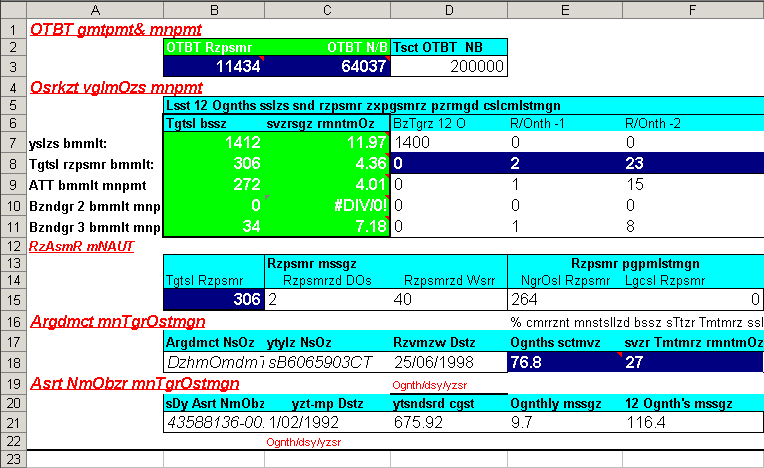{.absolute top="260" left="50" width="800" height="415"}
:::


## Tidy Penguins

```{r, echo=TRUE}
penguins
```

## Example

Notice anything wrong?

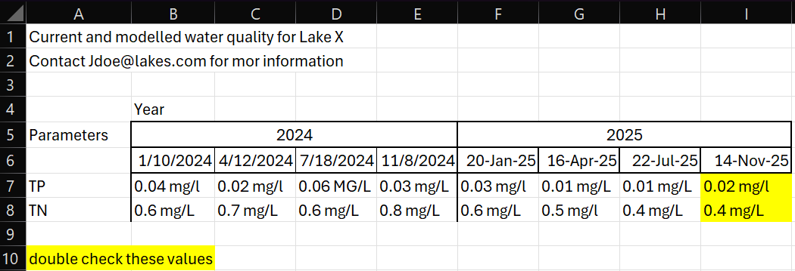{.absolute top="115" left="0" width="740" height="300"}


<div style="margin-top:10em;"></div>

:::{.fragment .fade-in}
- Unnecessary info at top can be moved to different sheet
- Inconsistent date formats
- Adding extra info to cells (units next to values)
- Coloring cells and leaving stand-alone cells (ok if color key in different sheet)
- Unnecessary table setup
:::

:::{.fragment .fade-in}
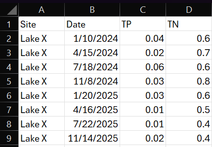{.absolute top="0" left="750" width="340" height="275"}
:::

:::{.fragment .fade-in}
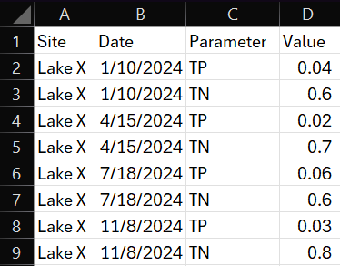{.absolute top="280" left="750" width="340" height="275"}
:::


##

{.absolute top="100" left="110" width="800" height="400"}

## Let's Recap

- R is a powerful (and free) tool for data analysis, visualization, and automation
- RStudio is an IDE for R that makes it easier to work with
- R offers many different functions and packages for data analysis
- Keep your code neat and organized with naming variables and adding comments
- There are different data types and structures in R
- Use the `tidyverse` to make data analysis easier and more efficient
- Keeping your data in a tidy format will save you from headaches later


## Keep in Mind Best Practices

Most of these are necessary but will help you in the long run

- Break code into sections
- Put `library()` calls at beginning of script
- Use comments to explain WHY the code is doing something rather than WHAT it's
  doing (unless it's a complex chunk of code)
- Keep naming conventions consistent
- Use the `<-` operator for assignment rather than `=`
- Keep lines of code to around 80 characters maximum (use the RStudio line as a
  guide)


## Continue Learning and Practicing!

-   [R Programming for Data Science](https://bookdown.org/rdpeng/rprogdatascience/) by Roger D. Peng
-   [R for Data Science](https://r4ds.had.co.nz/) by Hadley Wickham and Garrett
    Grolemund
-   [Big Book of R](https://www.bigbookofr.com/) by Oscar Baruffa
-   [R Weekly Blog/Podcast](https://rweekly.org/)
-   [RStudio Cheatsheet](https://rstudio.github.io/cheatsheets/html/rstudio-ide.html?_gl=1*qpfst1*_ga*NzM5Njk3Njk4LjE2OTI2MzYxODk.*_ga_2C0WZ1JHG0*MTc0NjE5ODU0My4xNjQuMC4xNzQ2MTk4NTQzLjAuMC4w)
-   YouTube videos, CodeAcademy, DataCamp
-   Practice, practice, practice
-   Don't feel like you have to memorize everything, Google is your friend


## Thank you!

<!-- You have to type 'quarto add quarto-ext/fontawesome' into the terminal
to download the fontawesome extension for this to work-->

::: columns
::: {.column width="60%"}
<br>

 [rpubs.com/aman11/flms_R_workshop_2026](https://rpubs.com/aman11/flms_R_workshop_2026)

 [PCDEM/flms_R_workshop_2026](https://github.com/PCDEM/flms_R_workshop_2026)

 [alex-manos](https://www.linkedin.com/in/alex-manos-228115113/)

 [almanos\@pinellas.gov](mailto:almanos@pinellas.gov)

:::

::: {.column width="40%"}
{.absolute top="115" left="640" width="530" height="120"}
:::
:::